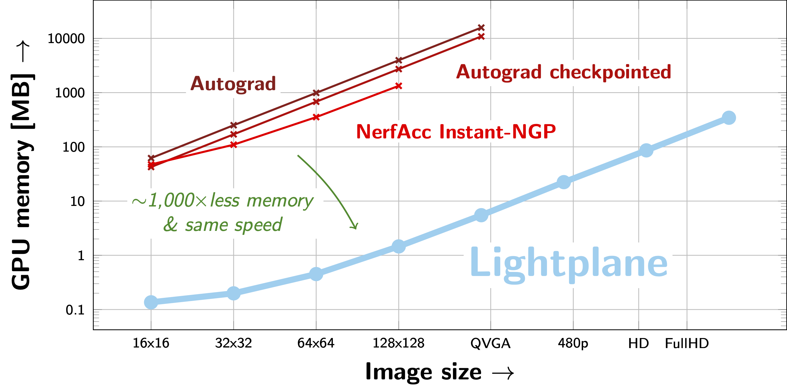

# Lightplane

Lightplane implements a highly memory-efficient differentiable radiance field renderer, and a module for unprojecting features from images to general 3D grids, described in our paper: 

**Lightplane: Highly-Scalable Components for Neural 3D Fields**

*Ang Cao*, *Justin Johnson*, *Andrea Vedaldi*, *David Novotny* 

[Project Page](https://lightplane.github.io/) | [Arxiv](https://arxiv.org/abs/2404.19760) | [Docs](https://lightplane.github.io/docs/)

**Lightplane can differentiably render batches of FullHD images** while consuming **less than a GigaByte** of GPU memory.
Rendering / backpropagation speed is comparable to existing methods, which however exceed memory limits already for a single QVGA image (640x480).
As such, Lightplane's memory and compute efficiency allows to drastically scale-up the latest neural field methods.




## Documentation

Please visit the [documentation website](https://lightplane.github.io/docs/) for a detailed project and API description.


## Overview

Lightplane is a pair of highly-scalable components for rendering neural 3D fields.
It consists of two components: **Lightplane Renderer** and **Lightplane Splatter**.

- **Lightplane Renderer** (3D --> 2D) is a radiance field renderer which, given a camera viewpoint and a scene grid structure (triplane, voxel grid, etc.), renders the corresponding image.
- **Lightplane Splatter** (2D --> 3D) is dual to Renderer: it takes image features and lifts/unprojects them to a 3D grid structure.

These two components are implemented as a pair of fused auto-optimized [Triton](https://github.com/openai/triton) GPU kernels.

Key features include:

- **Memory Efficiency**: Lightplane dramatically saves memory usage with competing speed compared to existing methods. When rendering a 256x256 image for backpropgation, it uses 10 MB GPU memory while Pytorch implementation uses 10 GB.
- **Highly Scalable**: The memory efficiency of Lightplane significantly boosts the scalability of 3D reconstruction/generation models. 
It allows lifting/unprojecting of hundred views, rendering high-resolution multiview images, with little memory usage. 
- **Easy to Extend**: Lightplane is a general design for 3D grid structures. Besides voxel grids and TriPlanes, it can be easily extended to other 3D grids (e.g. hash grid, HexPlane ...). More support is coming. 
- **Easy to Use**: Lightplane is powerful, configurable and easy to use.


## Installation

1) [Install PyTorch](https://pytorch.org/get-started/locally/#start-locally).
2) Install [COG](https://pypi.org/project/cogapp/), [Triton](https://github.com/openai/triton) and [plotly](https://plotly.com/python/):
```bash
pip install cogapp
pip install triton
pip install plotly
```
3) Install the LightPlane package:
```bash
pip install -e .
```
4) (Optional for running example code and jupyter notebooks)
    
    1) [Install PyTorch3D](https://github.com/facebookresearch/pytorch3d/blob/main/INSTALL.md)
    2) `pip install notebook`
    3) `pip install imageio opencv-python lpips matplotlib`
    4) `pip install configargparse tqdm`


## Usage

Lightplane Renderer and Splatter are packaged into ```torch.nn.Module```, which are easy to use as plugins in neural 3D field pipelines.

**Using Lightplane Renderer**:

```python
from lightplane import LightplaneRenderer, LightplaneSplatter, Rays

# Setup the gpu device the rendering module.
device=torch.device("cuda:0")
renderer = LightplaneRenderer(
    num_samples=128,
    color_chn=3,
    grid_chn=3,
    mlp_hidden_chn=32,
    mlp_n_layers_opacity=2,
    mlp_n_layers_trunk=2,
    mlp_n_layers_color=2,
    ray_embedding_num_harmonics=3,
).to(device)

# Create 128 random rendering rays:
num_rays = 128
rays = Rays(
    directions=torch.randn(num_rays, 3) * 0.1,
    origins=torch.randn(num_rays, 3),
    grid_idx=torch.zeros(num_rays, dtype=torch.int32),
    near=torch.full(num_rays, 0.1),
    far=torch.full(num_rays, 3.0),
)

# Create a random triplane.
batch_size = 1
channels = 16
H = W = D = 64  # triplane spatial size
feature_grid = [
    torch.randn(batch_size, 1, H, W, channels, device=device),
    torch.randn(batch_size, D, 1, W, channels, device=device),
    torch.randn(batch_size, D, H, 1, channels, device=device),
]

# Render the triplane.
(
    rendered_ray_length,
    negative_log_transmittances,
    rendered_features,
) = renderer(rays=rays.to(device), feature_grid=input_grid)

# get the rendering alpha mask in range [0, 1] from negative log transmittances
alpha = (-negative_log_transmittances).exp()
```

**Using Lightplane Splatter**:

The following splats features to a voxel grid using `Rays` from the previous snippet:
```python
# Initialize the splatter module
splatter = LightplaneSplatter(
    num_samples=256,
    grid_chn=channels,
).to(device)

# Assign the per-ray image features to splat to the `encoding` field of `rays`.
rays.encoding = torch.randn(num_rays, channels, device=device)

# Set the size of the output voxel grid which we splat features to:
grid_size = [(batch_size, D, H, W, channels)]

# Run Splatter.
splatted_grid = splatter(
    rays=rays,
    grid_size=grid_size,
)
```


## Examples

Please visit [examples](./examples/README.md) for more detailed example python scripts and jupyter notebooks.


## TODO

We plan to implement two major new functionalities:
1) Support for hash-grids
2) Support for temporal grids, e.g. HexPlane


## License

Lightplane is released under the [BSD 3.0 License](LICENSE).


## Citation

```
@article{cao2024lightplane,
    author = {Ang Cao and Justin Johnson and Andrea Vedaldi and David Novotny},
    title = {Lightplane: Highly-Scalable Components for Neural 3D Fields},
    journal = {arXiv},
    year = {2024},
}
```