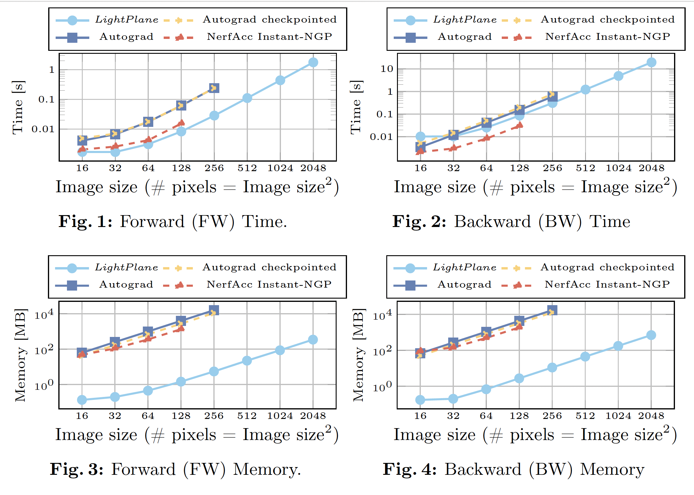

# Memory & Speed Benchmark

We have compared Lightplane's memory consumption and execution time of forward and backward passes 
with three baselines: 
- **PyTorch Autograd implementation**
- **PyTorch Autograd implementation with checkpointing**
- **NeRFAcc's Instant-NGP**

The following figure plots memory consumption and execution speed of each method as a function of the render size:



We can observe **up to 1000x memory savings** compared to the best baseline at similar (or even better) speed for both backward and forward passes.

```{note}
The Lightplane kernel benchmarks can be rerun using the renderer_speed_benchmark.py and splatter_speed_benchmark.py scripts under the tests directory.
```