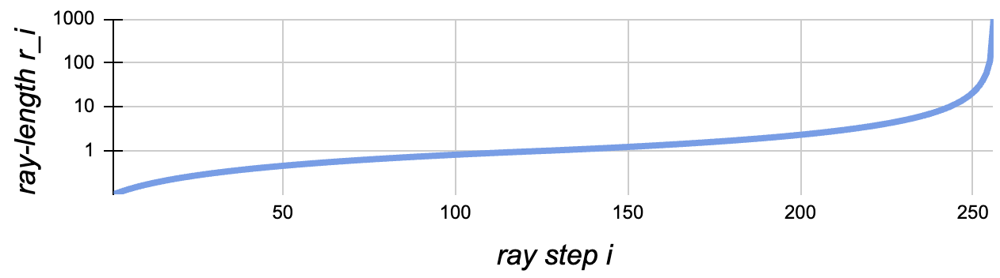

# Lightplane Renderer

## Renderer module API

The Lightplane Renderer operator is implemented via following interfaces:
- PyTorch module: [`LightplaneRenderer`](lightplane.LightplaneRenderer)
- Functional interface: [`lightplane_renderer`](lightplane.lightplane_renderer)

Visit [Lightplane Renderer API reference](./lightplane_renderer_api.md) for detailed documentation.


## EA rendering with MLP decoding
Lightplane Renderer implements the Emission-Absorption (EA) method which marches along rendering rays in order to image a [3D feature grid](./feature_grids.md) (represented with a grid-list `grid`).
It outputs the final color `c`, alpha value `m` and expected ray-termination length `r` of each ray's pixel, as follows:

1) Sample `N=num_samples` equispaced 3D points `pt_3d_i` between the `near` and `far` ray-lengths:
    ```
    pt_3d_1, ..., pt_3d_N = origin + t * direction, t = linspace(near, far, num_samples)
    ```
2) Using Lightplane's MLP decoder, each sampled point `pt_3d_i` is annotated with opacity value `o_i` and color vector `c_i` (of an arbitrary dimension). Here opacity `o_i = softplus(ro_i)` is a softplus-activated raw opacity `ro_i`, and `c_i = sigmoid(lc_i)` is output by a sigmoid activation of predicted color logits `lc_i`.

    The architecture of the decoder depends on the value of `use_separate_color_grid` argument of [`LightplaneRenderer`](lightplane.LightplaneRenderer):

    1) `LightplaneRenderer.use_separate_color_grid==False`
        ```
        grid -> f_i -> trunk_mlp -> e_i -> e_i + ray_encoding -> color_mlp -> c_i
                                        -> opacity_mlp -> o_i
        ```
        An MLP `trunk_mlp` maps the grid-sampled feature `f_i` to a trunk feature `e_i`, which is later converted to opacity and color with a pair of additional color and opacity MLP heads `color_mlp` and `opacity_mlp`. The trunk feature `e_i` is summed with `ray_encoding` before `color_mlp` to make the predicted color viewpoint dependent.

    2) `LightplaneRenderer.use_separate_color_grid==True`
        ```
        grid       -> f_i  -> opacity_mlp -> o_i
        color_grid -> cf_i -> cf_i + ray_encoding -> color_mlp -> c_i
        ```
        The lightplane kernel receives a pair of opacity and color grid-lists `grid` and `color_grid`. Each grid-list is sampled yielding features `f_i` and `cf_i` respectively, followed by a grid-specific MLP (`opacity_mlp`, `color_mlp`) converting the sampled feature to opacity and color. The color feature `cf_i` is summed with `ray_encoding` before `color_mlp` to make the predicted color viewpoint dependent.

3) The list of colors and opacities predicted for each point along the ray is integrated to form the final color render `c` (real vector), ray-length render `r` (scalar in `[0, inf]`), and alpha value `m` (scalar in `[0, 1]`):
```
c = sum_[i=0 ... N] (T_(i-1) - T_i) * c_i  # color render
r = sum_[i=0 ... N] (T_(i-1) - T_i) * delta_i  # ray-length render
m = 1 - T_N  # alpha value
T_i = exp[-(gain * delta_0 * o_0 + ... + gain * delta_i o_i)]  # transmittance
```
where `delta_i` is the distance between two adjacent samples along the ray, and `T_i` is the Transmittance of `i`-th point.


## Renderer configuration

### Scaffolded rendering
Lightplane allows to use a binary voxel-grid scaffold to fast-track raymarching for ray-points that are known to be unoccupied (i.e. they have 0 opacity `o_i==0`).
If the scaffolded raymarching is enabled, the renderer will first sample the binary scaffold voxel grid using nearest neighbor interpolation.
For a non-zero scaffold indicator, the renderer will proceed with MLP-decoding the sampled feature to opacity and color.
If the scaffold indicator yields zero, the renderer will skip MLP-decoding and directly output 0 opacity and color for the point.

```{note}
Scaffolded ray-marching is enabled by setting the `scaffold` argument of [`LightplaneRenderer.forward`](lightplane.LightplaneRenderer.forward) to a 
binary `(B, D, H, W)` tensor.
```

### Opacity noise injection
To prevent the renderering decoder from collapsing to predicting zero opacities everywhere, the renderer also supports random opacity noise injection.
If enabled, the opacity `o_i = softplus(ro_i + n_i); n_i ~ N(0, inject_noise_sigma)` is redefined to `softplus`-activate the predicted raw opacity jittered with a noise vector `eps` sampled from a zero-centered Gaussian with variance `inject_noise_sigma`.

```{note}
Opacity noise injection is enabled by setting the `inject_noise_sigma` argument of [`LightplaneRenderer`](lightplane.LightplaneRenderer) to a value bigger than 0. Reproducible rendering passes can be achieved by setting the seed `inject_noise_sigma` of the random noise to an integer.
```

### Modeling background
The default Lightplane renderer only represents points lying inside the `[-1,1]` NDC cube which can be limiting for unbounded outdoor scenes where representing distant background is important.

To help representing the background, Lightplane supports two important tools:
a) Disparity-space background ray-point sampling 
b) Coordinate contraction

#### Disparity-space background ray-point sampling 
In order to render distant parts of the scene, inspired by [NeRF++](https://arxiv.org/abs/2010.07492), Lightplane supports sampling of ray points beyond the `far` plane with disparity spacing.

More specifically, `Delta_i` defines the sample spacing of between the `i`-th and `i+1`-th 3d point `far_pt_3d_i` beyond sampled beyond its ray's `far` ray-length as:
```
Delta_i = far / ((i + 1) * (disparity_at_inf - 1) / num_samples_inf + 1)
```
Here, `num_samples_inf` corresponds to the total number of background ray-points and `disparity_at_inf` is a small constant defining the disparity of the last sample along the ray.

For illustration, the following plots the ray-length `r_i = sum(delta_0, ..., delta_N, Delta_0, ..., Delta_i)` as a function of the index `i` of the point along the ray: 



For the following settings: `num_samples = num_samples_inf = 128, disparity_at_inf = 0.001, near = 0.1, far = 1.0`.

```{note}
The disparity-space sampling is enabled by setting `num_samples_inf` in [`LightplaneRenderer`](lightplane.LightplaneRenderer) to an integer value > 0.
```

#### Coordinate contraction
Disparity-space sampling alone is inefficient for modelling distant space because the grid-list represents only the space within the `[-1,1]` cube.

To deal with the latter, following [MERF](https://arxiv.org/abs/2302.12249), we allow the box-based coordinate contraction function which ensures that any finite 3D point `pt_3d` lands lands within the `[-1, 1]` cube:
```
                     0.5 * pt_3d[k]                                   if |pt_3d|_inf <= 1
contract(pt_3d)[k] = 0.5 * pt_3d[k] / |pt_3d|_inf                     if pt_3d[k] != |pt_3d|_inf > 1
                     0.5 * (2 - 1/pt_3d[k]) pt_3d[k] / |pt_3d[k]|     if pt_3d[k] = |pt_3d|_inf > 1
```
where `k in [0, 1, 2]` is the coordinate index.

When coordinate contraction is enabled, it is applied to the ray-point before just before sampling features from the grid-list:
```python
pt_3d = contract(origin + t * direction)
```

```{note}
Coordinate contraction is enabled by setting `contract_coords` in [`LightplaneRenderer`](lightplane.LightplaneRenderer) to `True`
```